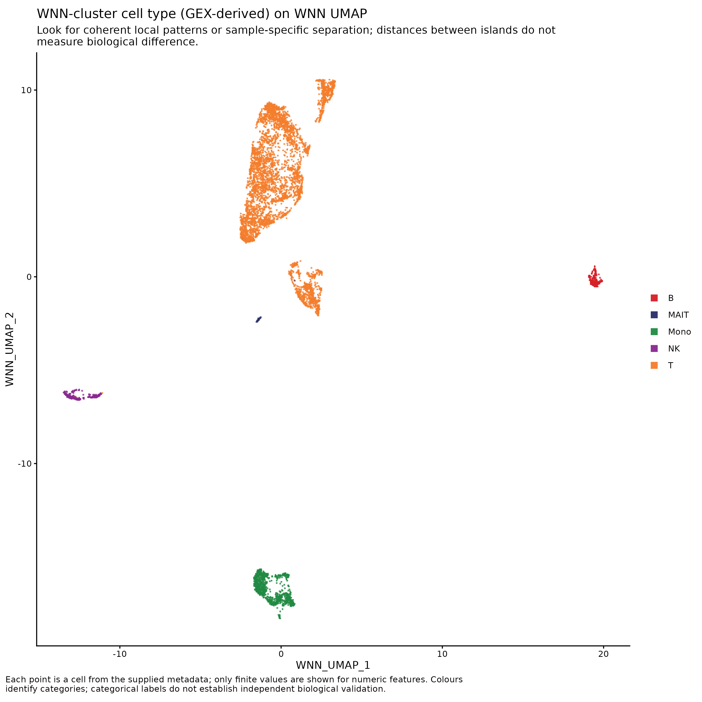

# Inspect the demo results

The demo saved its results in the targets store, the `outputs/` folder of the clone (set by `store` in `_targets.yaml`; later pages write `<store>`). The store holds three kinds of output:

- `objects/`: R objects, such as tables and the Seurat/Signac object.
- `files/`: data files, such as matrix folders and TSV tables.
- `plots/`: PNG plot images.

This page opens one example of each kind in the R session and shows what the public demo prints. The [output reference](review_outputs.md#output-folders) describes the folders in detail.

## Objects

Read a stored object by its target name with `targets::tar_read()`, here the cell metadata:

```{.r filename="R"}
cell_metadata <- targets::tar_read(
  metadata_w_cell_types_tibble.WNN.immune_human_2x
)
cell_metadata
```



The table has one row per retained nucleus, with its QC metrics, GEX, ATAC and WNN clusters, cell-type labels and UMAP coordinates. The multimodal Seurat/Signac object is a convenience export for exploring the results with Seurat and Signac:

```{.r filename="R"}
demo_object <- targets::tar_read(
  multimodal_Seurat_object.8_multimodal_QC.immune_human_2x
)
demo_object
```



The object reads its count matrices and ATAC fragments from files in the store and `example_data/`, so keep those folders in place.

## Files

For a file target, `tar_read()` returns the path of the saved file or folder:

```{.r filename="R"}
targets::tar_read(cellranger_barcodes_tsv.healthy_PBMC_human)
```



Open the file with a suitable reader, here BPCells for the aggregated gene-expression counts:

```{.r filename="R"}
GEX_counts <- BPCells::open_matrix_dir(
  targets::tar_read(aggregated_GEX_BPCells_matrix_dir.GEX.immune_human_2x)
)
GEX_counts
```



The first file belongs to one GEM well, the second to the aggregation. Paths follow the target name from right to left: `aggregated_GEX_BPCells_matrix_dir.GEX.immune_human_2x` is saved in `outputs/files/immune_human_2x/GEX/aggregated_GEX_BPCells_matrix_dir/`. `consensus_peak_BPCells_matrix_dir.ATAC.immune_human_2x` holds the ATAC peak counts.

## Plots

Plot targets return image paths in the same way, under `outputs/plots/`. The demo built one categorical UMAP per variable:

```{.r filename="R"}
unlist(
  targets::tar_read(categorical.UMAPs.8_multimodal_QC.immune_human_2x),
  use.names = FALSE
)
```



Open `WNN_harmony_SNN_cluster_cell_type.png` from that list to see the WNN clusters labeled by cell type:

{width="70%"}

Plot subtitles and captions explain how to read each plot.

## Customize a plot

Plots are saved as images only. To change one, redraw it from the data it shows. `targets::tar_manifest()` returns the command of a plot target, which names its plotting helper and input targets:

```{.r filename="R"}
plot_target <- targets::tar_manifest(
  names = "categorical.UMAPs.8_multimodal_QC.immune_human_2x",
  fields = command
)
cat(plot_target$command)
```



Read the inputs with `targets::tar_read()`, call the helper to get a ggplot object, edit it with the usual ggplot2 functions and save your copy outside the store, where a rerun cannot overwrite it.

## Possible next steps

- Build the rest of the demo aggregation, including every checkpoint plot, with `targets::tar_make()`. The demo configuration has no other active aggregation and no optional modules.
- Browse the [output gallery](gallery.md) for an example of every plot the pipeline and its optional modules save.
- Start your own analysis with [Plan your analysis](main_overview.md).
