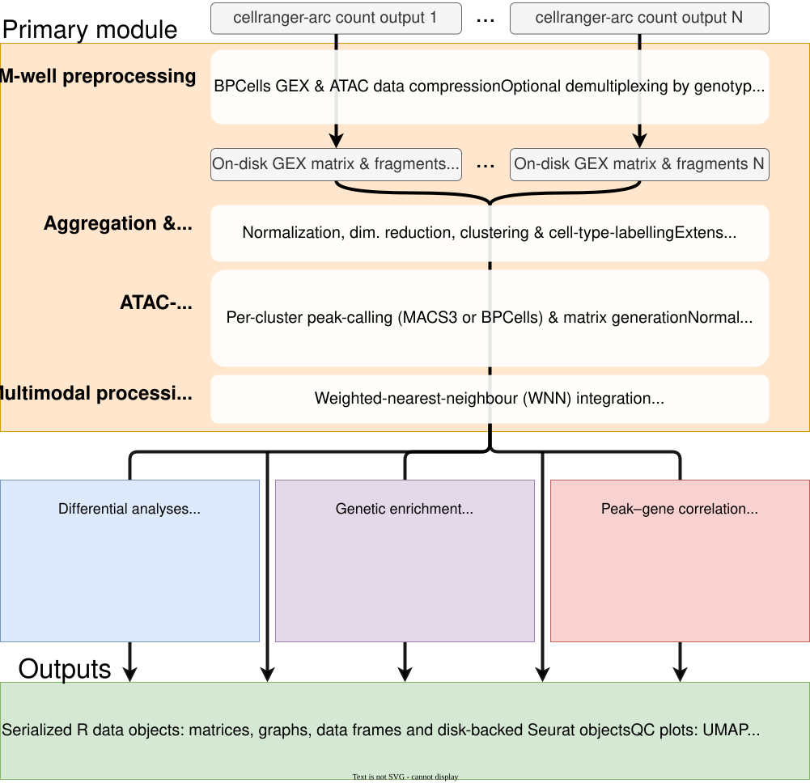

{fig-alt="multiomeR logo" width="100%"}

# Introduction

## What is multiomeR?
multiomeR is a [targets](https://books.ropensci.org/targets/)-based workflow for processing and analyzing single-nucleus 10x Genomics Multiome ATAC + Gene Expression datasets. It is meant to be adapted to your own data, compute setup, and biological questions.

The workflow starts from `cellranger-arc count` outputs, processes gene-expression (GEX) and ATAC data, builds multimodal aggregations, and supports optional downstream modules for differential analyses and genetic enrichment for human datasets.

## Development status
multiomeR is currently in beta. Expect breaking changes as the workflow is maturing. Report issues, questions, and feature requests on GitHub.

## Why use it?
- **Adaptable framework**: The repository is meant to be modified through config files, target selections, helper functions, and optional modules.
- **Transparent execution**: Each processing and analysis step is represented as an explicit `targets` target.
- **Efficient reruns**: `targets` reruns only the parts of the workflow affected by changed inputs, code, or config.
- **Multimodal analysis**: The main pipeline covers RNA/ATAC processing, clustering, cell typing, WNN integration, and optional downstream modules.

## Choose your route

| If you want to... | Start here |
|---|---|
| See what the workflow produces | Browse the [main pipeline output gallery](gallery_main.qmd). |
| Try multiomeR on public data | Follow the three-part quickstart: [install](demo_installation.qmd), [run](demo_running.qmd), then [inspect the outputs](demo_outputs.qmd). |
| Configure your own data | Read the [main-pipeline overview](main_overview.qmd), prepare the [configuration and inputs](main_inputs.qmd), then [run the checkpoints](main_running.qmd). |
| Add a downstream analysis | Check the prerequisites for [differential analyses](downstream_differential_analyses.qmd) or [genetic enrichment](downstream_genetic_enrichment.qmd). |
| Understand or modify the internals | Use the separate [implementation book](implementation/). |

Before starting, you need Linux and basic familiarity with R, tabular metadata, and `targets`. The demo supplies a working configuration; your own analysis also needs complete `cellranger-arc count` outputs, a matching reference, and keyed GEM well and donor metadata. Tutorial pages provide a safe route through the workflow; searchable parameter tables and the implementation book are references to consult as needed.

In this manual, a **GEM well** is one configured 10x library and output directory, a **dataset** groups GEM wells that share reference and QC settings, and an **aggregation** is a joint analysis of one or more GEM wells. A **donor** is the individual identified by `donor_id`; one GEM well may contain multiple donors.

## Workflow at a glance

The **main pipeline** processes each GEM well, aggregates selected GEM wells, and builds multimodal RNA/ATAC outputs for clustering, cell typing, and WNN integration. Two optional modules extend completed aggregations with differential analyses or genetic enrichment.

