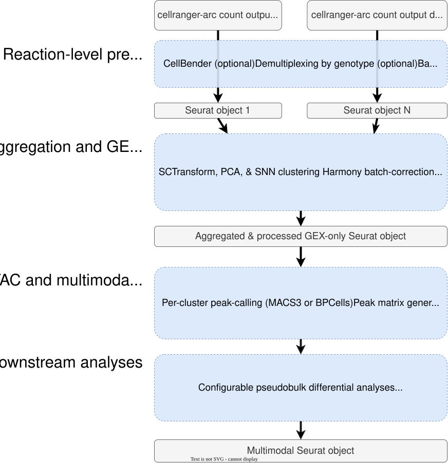

# Overview

## How the workflow is organized

multiomeR is organized around one main pipeline and optional downstream modules.

The **main pipeline** is the workflow most users run first. It starts from `cellranger-arc count` outputs, processes each 10x reaction, aggregates selected reactions, and builds multimodal RNA/ATAC outputs for clustering, cell typing, and WNN integration.

The **modules** are optional branches that run from configured aggregations. Enable them only when the relevant input data and biological question are present.

- **[Main pipeline](reaction_aggregation_walkthrough.qmd)**: Per-reaction QC, dataset-level merging, BPCells-native RNA/ATAC processing, clustering, cell typing, and WNN integration.
- **[Differential analyses](differential_analyses_walkthrough.qmd)**: Optional aggregation module for datasets with experimental or phenotypic variables that should be modelled across cell type composition, pseudobulk expression, chromatin accessibility, and TF activity.
- **[Genetic enrichment](genetic_enrichment_walkthrough.qmd)**: Optional human-data module for GWAS-informed chromatin accessibility enrichment and trait-relevance analyses.
